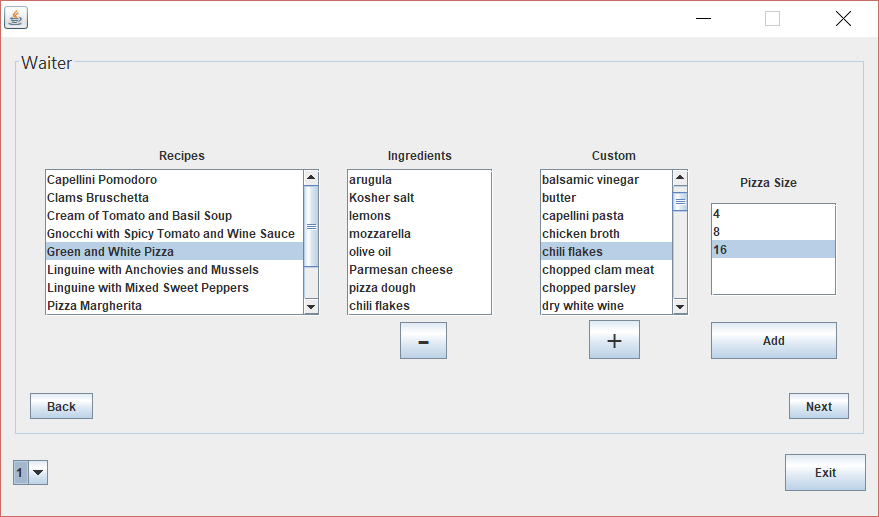
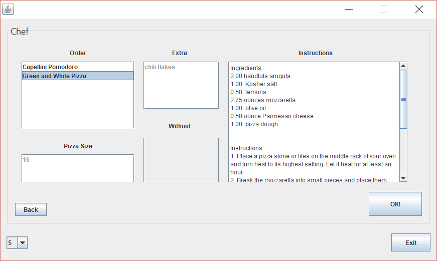
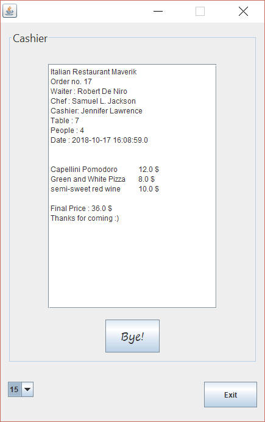

# Italian Restaurant

This project consists of 2 parts:

1. Restaurant database creation
2. Restaurant staff GUI

## Database

The database of the restaurant includes the dishes, the drinks, the employers and the customers. It is accessed by the GUI through Java Database Connectivity (JDBC).

## Graphical User Interface

The waiter, the chef and the cashier have their own user interfaces.

First, the waiter takes the order from a table, then the chef prepares the dishes and then the cashier prints the receipt.

## Prerequisites

- MySQL Connector 5:

    Download the [jar file](https://mvnrepository.com/artifact/mysql/mysql-connector-java/5.1.47) and include it in the project's classpath (project properties -> libraries -> add jar).

## Usage

1. Create a MySQL database named `restaurant`. The username should be `root` and the password should be left blank.
2. Import the sql files.
3. Run the project and make orders as described above.

## Screenshots

